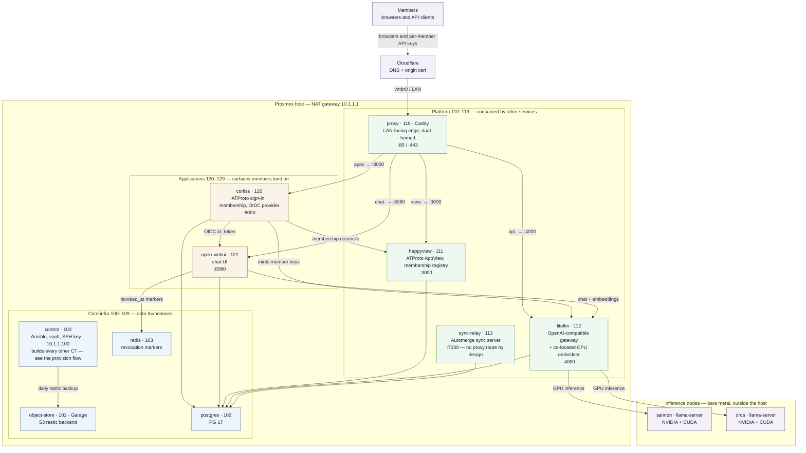
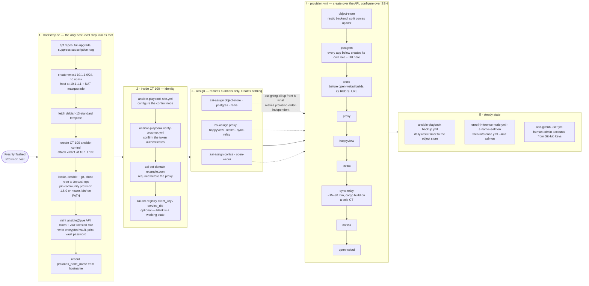
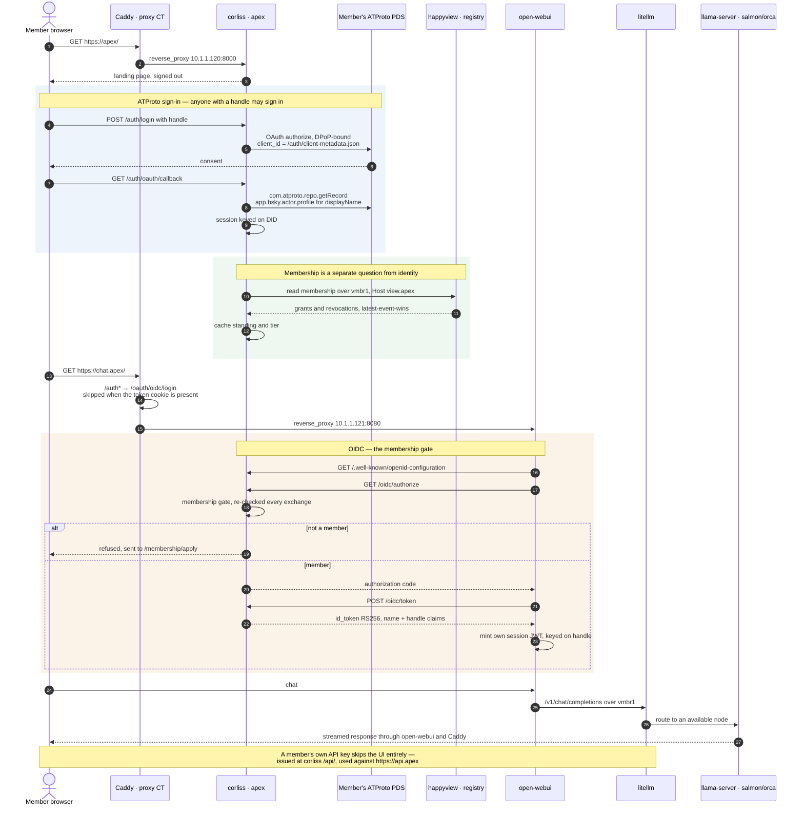
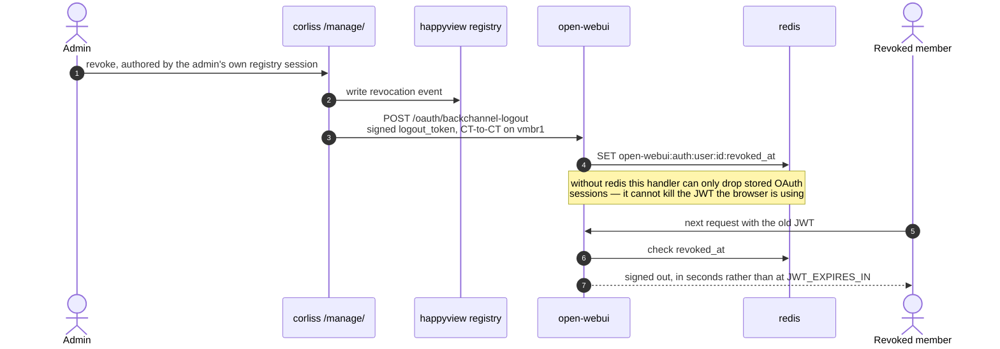

# Diagrams

Three views of the same cluster, drawn in [Mermaid](https://mermaid.js.org/) so
they render on GitHub and stay diffable in review:

- [Cluster topology](#cluster-topology) — what exists and how it's wired.
- [Build and provision flow](#build-and-provision-flow) — how a bare host becomes that.
- [Member login path](#member-login-path) — what a member's request actually walks through.

Everything here is derived from the committed blueprint
([`inventory/hosts.yml`](../ansible/inventory/hosts.yml), the
[`proxy`](roles/proxy.md) role's `caddy_proxy_hosts`, and the role docs). The
**CTIDs shown are the example layout** from the [README](../README.md) — real
numbers are per-cluster runtime data bound with `zai-assign`, so read them as
tier markers, not identity. See [Service CTID
assignment](README.md#service-ctid-assignment).

---

## Cluster topology

The proxy is the only LAN-facing container; everything else lives on the
uplink-less `vmbr1` and routes out through the host's NAT. The inference nodes
are bare metal, outside the Proxmox host entirely.

**Reading the tiers.** The line between platform and applications is *who talks
to it* — platform CTs are consumed by other services, application CTs are
consumed by members. That rule does **not** separate core from platform: what
makes core infra core is that it is the data foundations, storage with no logic
of its own. `corliss` is an application despite doing the authentication;
`litellm` and `sync-relay` stay platform even though a member's own client
connects to each directly, because neither has a page anyone lands on. See
[CTID tiers](README.md#networking).

**Two edges worth noticing:**

- `sync-relay` has **no** `caddy_proxy_hosts` entry on purpose — the Phase A
  relay enforces no membership, so `vmbr1` is the entire access boundary
  ([ADR-0007](decisions/0007-sync-relay-and-space-membership.md)). Do not add a
  route before the Phase B verifier lands.
- The dotted `corliss → happyview` and `corliss → open-webui` service calls go
  **CT-to-CT over `vmbr1`**, not out through Cloudflare and back — they are
  recovery and revocation paths that must not depend on public DNS, the CDN and
  the proxy CT all being up.

---

## Build and provision flow

One host-level script, then everything from inside CT 100. The two-pass shape —
assign every CTID first, provision second — is what lets each role render
cross-service references regardless of provisioning order.

**Why assign is its own pass.** The proxy's Caddy route points at litellm's
derived address (`10.1.1.<litellm-ctid>`); if litellm has no CTID yet, the
Caddyfile fails to render. Binding every number first sidesteps the whole class
of ordering problem — see [Service CTID
assignment](README.md#service-ctid-assignment).

**The ordering that is still real** (data dependencies, not convenience):

| Must come first | Because |
| --------------- | ------- |
| `object-store` | it is the restic backend `backup.yml` writes to |
| `postgres` | `happyview`, `litellm`, `sync-relay`, `corliss` and `open-webui` each create their own role + database on it |
| `redis` | `open-webui` builds its `REDIS_URL` from that CT's address |

`corliss` additionally needs `sync-relay`, `redis`, `object-store` and `proxy`
to have been **assigned** — its `/systems/` probe URLs derive from `hostvars`
unguarded. That is an inventory dependency, not an ordering one: `zai-assign` is
the fix, no provisioning required.

---

## Member login path

What a member actually walks through, from typing the apex to a token reaching a
GPU. Everything crossing the LAN goes through Caddy; everything between two CTs
stays on `vmbr1`.

### Revocation — why redis exists

Open WebUI authenticates from its **own** session JWT after the exchange, so
corliss is not consulted again until that token expires. The gate at
`/oidc/authorize` therefore cannot end a session already in flight; the
back-channel can.

**The two addresses for the same service are not interchangeable.** `corliss`
reaches `happyview`, `litellm` and `open-webui` at their **internal**
`10.1.1.x` addresses, while the links it renders for a member's browser use the
public origins. Conflating them breaks quietly: the internal happyview call must
still present `Host: view.<domain>` or the AppView answers HTTP 421, and
`corliss_api_url` (what a member points a client at) is not
`corliss_litellm_url` (what corliss calls to mint that member's key).
